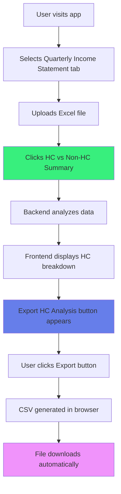
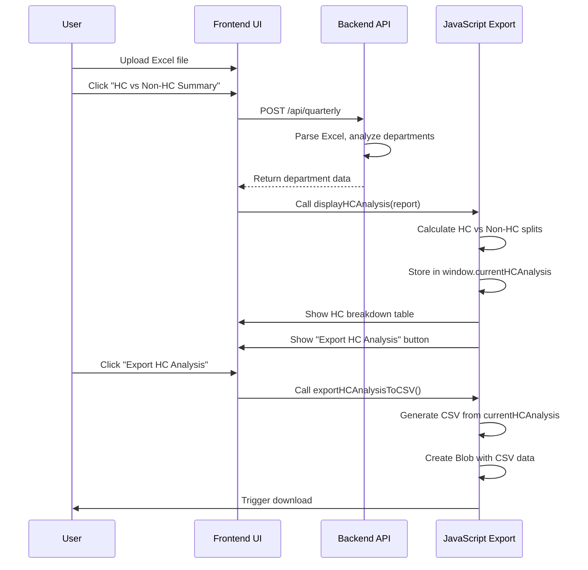
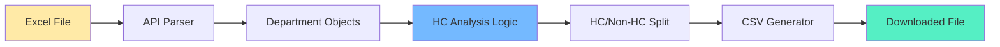
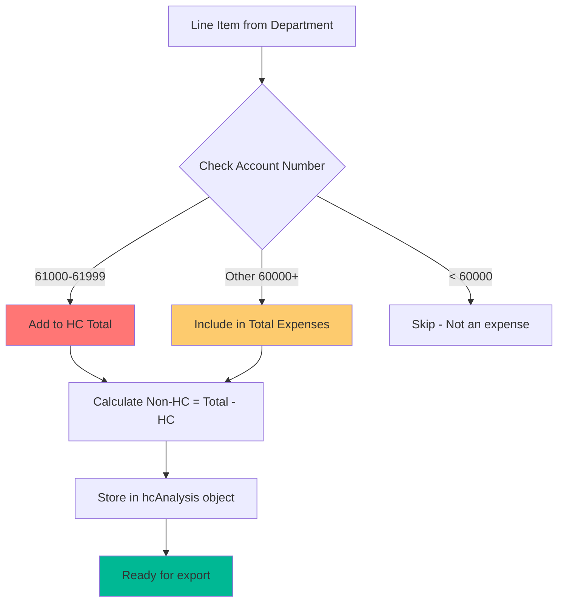
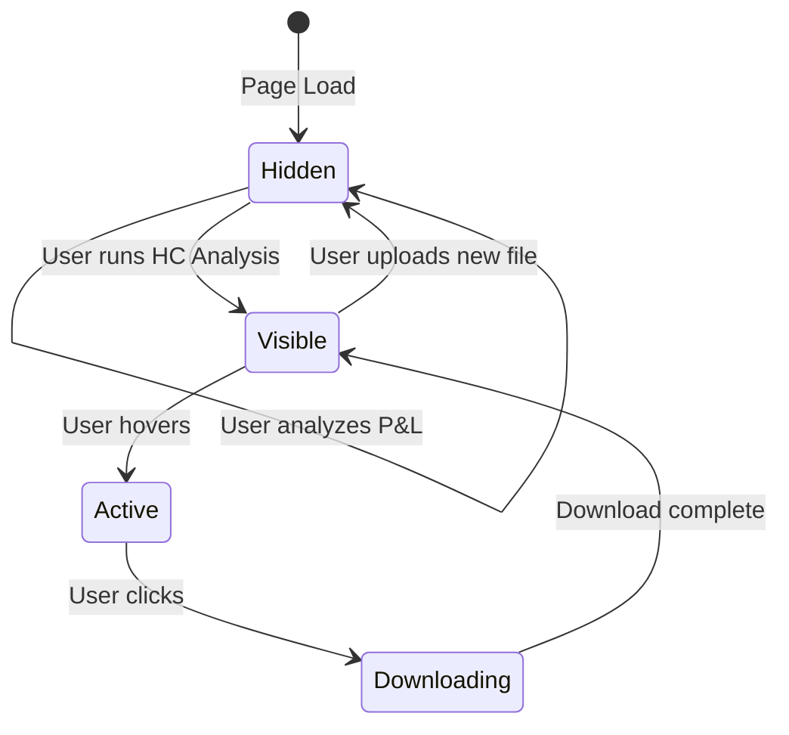
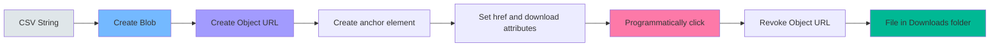
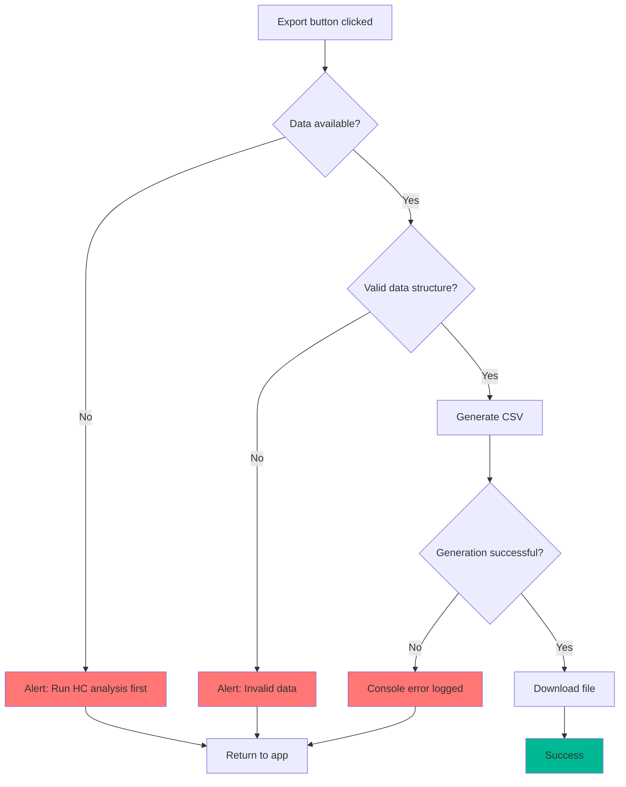

# HC Analysis Export Flow

## User Journey



## Technical Flow



## Data Transformation



## HC Classification Process



## Export Button State Management



## CSV Structure

```
┌─────────────────────────────────────────────────┐
│ HC vs Non-HC Breakdown                          │ ← Header
├─────────────────────────────────────────────────┤
│ Company, [Company Name]                         │ ← Metadata
│ Period, [Period]                                │
├─────────────────────────────────────────────────┤
│ [Blank Line]                                    │
├─────────────────────────────────────────────────┤
│ Department, HC (61000 series), Non-HC, Total    │ ← Column Headers
├─────────────────────────────────────────────────┤
│ Engineering, $500,000.00, $150,000.00, ...      │ ← Data Rows
│ Sales & Marketing, $300,000.00, $200,000.00, ...|
│ Operations, $200,000.00, $100,000.00, ...       │
├─────────────────────────────────────────────────┤
│ TOTAL, $1,000,000.00, $450,000.00, ...          │ ← Summary Row
└─────────────────────────────────────────────────┘
```

## Key Functions

### displayHCAnalysis()
**Purpose:** Analyze and display HC vs Non-HC breakdown

```
Input: report object with departments
  ↓
Normalize department names
  ↓
For each department:
  - Find total expenses
  - Sum HC (61000 series)
  - Calculate Non-HC
  ↓
Store in window.currentHCAnalysis
  ↓
Display summary cards and table
  ↓
Show export button
```

### exportHCAnalysisToCSV()
**Purpose:** Generate and download CSV file

```
Check: window.currentHCAnalysis exists?
  ↓
Build CSV rows array:
  - Header row
  - Company/Period metadata
  - Column headers
  - Department rows
  - Total row
  ↓
Format as CSV string
  ↓
Create Blob
  ↓
Generate download link
  ↓
Trigger download
  ↓
Clean up resources
```

## Browser Export Mechanism



## Error Handling


